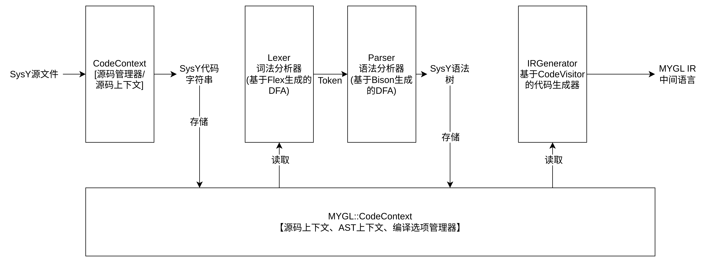

# MYGL-C前端指南

---

MYGL-C前端是MYGL-C管理源文件、解析源文件到IR的模块。

## 前端流程

如图所示: SysY源文件被读取到一个叫"CodeContext"的源码管理器里，以字符串形式存储。词法分析器/语法分析器(这两个对象是捆在一起的)从CodeContext中读出源码，分解为词法单元，通过LR方法转换为抽象语法树，然后存回CodeContext。紧接着，名为"IRGenerator"的中间代码生成器从CodeContext中读出语法树，把源代码翻译成便于优化的IR。

这一部分的3个核心是: 源码管理器CodeContext、语法树Ast和语法分析器(Lexer+Parser).

## 一些重要的类

### AST: 一组存储源码语义的对象

SysY的语法可以参考项目中的词法分析器(.l文件)与和语法分析器(.y文件)，由于是直接使用Bison+Flex写的，所以直观地展示了语法。

接下来重点讲述AST结点的分类。该项目几乎为每一种非终结符都创建了一种语法树结点，这些结点都最终继承于`MYGL::Ast::Node`对象，根据功能不同直接继承于不同的语法结点类。项目尽量保证每个能在语法树中出现的类属性都是final,但是目前有几个类(为了省代码量)没有做到。

接下来列举Ast命名空间下面所有的语法树结点类。

- [`MYGL::Ast::Node`](ast/nodes.md) -- 所有语法树结点的基类
  - `CompUnit` -- 编译单元，一般作为语法树的根结点
  - `ArrayType` -- `Type`结点的数组后缀，继承于`Node`的定义结点
  - `FuncParam` -- 函数定义`Function`的参数结点
- [`Statement`](ast/statements.md) -- 语句结点，包括代码块与代码块里的所有结点。语句本身会串成一个链表，但是语句之间没有所有权。
  - `Declaration` -- 变量与常量的声明语句
    - `ConstDecl` -- 常量声明
    - `VarDecl` -- 变量声明
  - `Block` -- 代码块，存放代码的语句
  - `EmptyStmt` -- 空语句，没有实际意义
  - `IfStmt` -- `if`语句或者`if-else`语句
  - `WhileStmt` -- `while`语句
  - `ReturnStmt` -- `return`语句
  - `BreakStmt` -- 条件语句/`while`语句的退出语句
  - `ContinueStmt` -- `continue`语句
  - `ExprStmt` -- 表达式的包装语句
- [`Expression`](ast/expressions.md) -- 语句内的表达式，以及成为表达式结点的元素
  - `UnaryExpr` -- 前缀一元表达式
  - `BinaryExpr` --  二元表达式
  - `AssignExpr` -- 赋值表达式，与二元表达式故意做了分隔
  - `CallParam` -- 函数调用参数列表
  - `Identifier` -- 标识符，用于标识函数/变量/常量
  - `CallExpr` -- 函数调用表达式
  - `InitList` -- 初始化列表，用于数组的初始化
  - `IndexExpr` -- 下标表达式
  - `Value` -- 值表达式
    - `StringValue` -- 字符串字面量表达式
    - `IntValue` -- 整数表达式
    - `FloatValue` -- 浮点表达式
- [`Definition`](ast/definition.md) -- 变量与类型的定义语句(函数定义也是类型定义)
  - `Type` -- 类型(基础类型、数组类型)
  - `Variable` -- 变量与常量共享的定义
  - `Function` -- 函数定义

还有一些不是语法树结点的类:

- [`CodeContext`](util/code-context.md) -- 源码管理器、AST管理器、前端的编译选项管理器
- [`CodeVisitor`](util/code-visitor.md) -- 语法树遍历工具
- [`Scope`](util/scope.md) -- 作用域
- [`SourceLocation`](util/source-location.md) -- 表示源码位置的结构体
- [`SourceRange`](util/source-location.md#source-range) -- 表示源码范围的结构体

### Lexer&Parser: 基于Flex/Bison编写的词法/语法分析器

- yyFlexLexer -- 可重入的词法分析器
- yy::parser  -- 可重入的语法分析器

## 一点来自开发者的话

@medihbt:

> 我在写这份前端代码的时候给自己提了一个额外的要求：一定要保证前端是**可重入**的。不知道这个做法对不对，但是目前已经完成的代码可以说是比较让我满意的。
>
> 前端语法树生成与验证的部分只剩注释没写了。现在正在写IR翻译部分。
